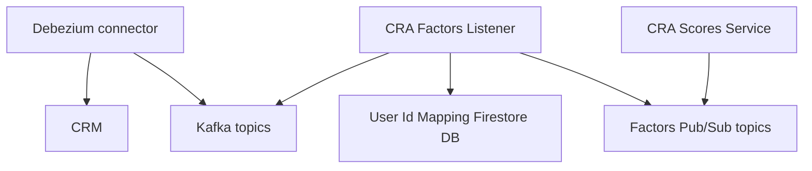

# CRA Factors Listener
[Production Readiness](productionreadiness.md)

This is a .NET Core microservice responsible for subscribing to events containing risk factors data. Having consumed
incoming Kafka message, the service filters the unchanged values, gets the user ID for each incoming message, and
publishes the changed data to pub/sub.

## Dependencies

## Datastore Usage

* The service uses a [Firestore](https://firebase.google.com/docs/firestore) for storing mappings:
    * `person-to-user`
    * `account-to-user`
    * `address-to-person`
    * `person-to-customerUUID`

* The service uses [Vault](https://vault.q3.questech.io/ui/vault/secrets/secret/list) for storing secrets.

## Resiliency patterns/degradation features

- The requests to the [GraphQL] use retry policy with exponential back-off
- API uses cloud data storage (Firestore) to avoid any data related issues
- All Kafka consumers are idempotent

## Contact

Slack Channel: [#team-tmj](https://questrade.slack.com/archives/C03J8C42TF1)

Alerts Channel: [#fincrime-fraud-aml-alerts](https://questrade.slack.com/archives/C04265WLMTR)

Email group: questrade-scrumteam-tmj@questrade.com

## Links
* [Wiki page](https://questrade.atlassian.net/wiki/spaces/FINCRIME/pages/46956776/CRA+Factors+Listener)
* [Dashboard](https://app.datadoghq.com/dashboard/8ah-3wg-9a7/cra-factors-listener?tpl_var_account_changed_topic_id=system.customer-risk-assessment.account.updated-1.0&tpl_var_address_info_crm_connector=dbz-mssql-source-cra-address-info-crm-1.0&tpl_var_app=cra-factors-listener&tpl_var_country_changed_topic_id=system.customer-risk-assessment.country.updated-1.0&tpl_var_env=prod&tpl_var_kube_namespace=cra-factors-listener&tpl_var_mapping_data_info_crm_connector=dbz-mssql-source-cra-mapping-data-crm-1.0&tpl_var_person_employment_changed_topic_id=system.customer-risk-assessment.person-employment.updated-1.0&tpl_var_politically_exposed_person_changed_topic_id=system.customer-risk-assessment.politically-exposed-person.updated-1.0&tpl_var_service=cra-factors-listener&tpl_var_user_info_crm_connector=dbz-mssql-source-cra-user-info-crm-1.0&from_ts=1660733152527&to_ts=1660819552527&live=true)
* [Monitors](https://app.datadoghq.com/monitors/manage?q=tag%3A%22service%3Acra-factors-listener%22)

## [Working with Apache Avro](https://github.com/confluentinc/confluent-kafka-dotnet/blob/master/README.md)

The Confluent.SchemaRegistry.Serdes.Avro nuget package provides an Avro serializer and deserializer that integrate
with [Confluent Schema Registry](https://docs.confluent.io/current/schema-registry/docs/index.html). The
Confluent.SchemaRegistry nuget package provides a client for interfacing with Schema Registry's REST API.

    * You can use the Avro serializer and deserializer with the GenericRecord class or with specific classes generated using the avrogen tool, available via Nuget (.NET Core 2.1 required):

      `dotnet tool install --global Apache.Avro.Tools`

    * Usage:

      `avrogen -s your_schema.avsc .`

      i.e :
      `avrogen -s BO\Confluent.SchemaRegistry\V1.PersonCommunication_Key.avsc BO\Confluent.SchemaRegistry\`

    * For more information about working with Avro in .NET, refer to the the blog post [Decoupling Systems with Apache Kafka, Schema Registry and Avro](https://www.confluent.io/blog/decoupling-systems-with-apache-kafka-schema-registry-and-avro/)

